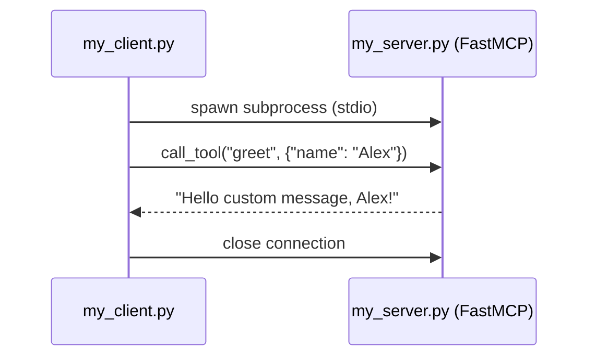
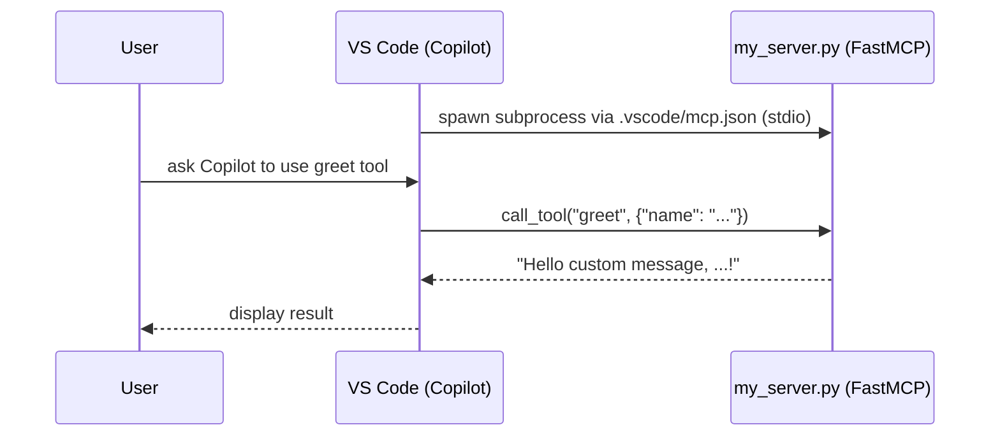

* Without an MCP host, creating the client

```mermaid
sequenceDiagram
    participant Client as my_client.py
    participant Server as my_server.py (FastMCP)

    Client->>Server: spawn subprocess (stdio)
    Client->>Server: call_tool("greet", {"name": "Alex"})
    Server-->>Client: "Hello custom message, Alex!"
    Client->>Server: close connection
```

* With VS Code as MCP Host

```mermaid
sequenceDiagram
    participant User
    participant VSCode as VS Code (Copilot)
    participant Server as my_server.py (FastMCP)

    VSCode->>Server: spawn subprocess via .vscode/mcp.json (stdio)
    User->>VSCode: ask Copilot to use greet tool
    VSCode->>Server: call_tool("greet", {"name": "..."})
    Server-->>VSCode: "Hello custom message, ...!"
    VSCode-->>User: display result
```